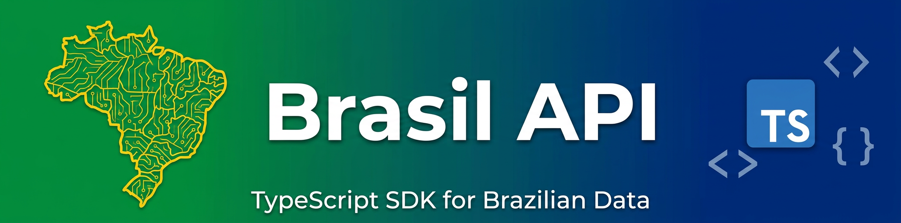

<div align="center">



# BrasilAPI SDK

**TypeScript SDK for Brasil API - Access Brazilian data with type safety and modern features**

[](https://www.npmjs.com/package/brasilapi-sdk)
[](https://www.npmjs.com/package/brasilapi-sdk)
[](https://github.com/guhcostan/brasilapi-sdk/actions/workflows/ci.yml)
[](https://opensource.org/licenses/MIT)
[](https://www.typescriptlang.org/)
[](https://nodejs.org)

[Features](#-features) • [Installation](#-installation) • [Quick Start](#-quick-start) • [Documentation](#-documentation) • [Contributing](#-contributing)

</div>

---

## 🚀 Features

A modern, production-ready TypeScript SDK for [Brasil API](https://brasilapi.com.br/) with comprehensive coverage of all 33 endpoints:

- ✅ **100% TypeScript** - Full type safety with comprehensive type definitions
- 🔄 **Automatic Retries** - Smart retry logic with exponential backoff
- 🛡️ **Error Handling** - Custom error types for better error management
- 📦 **Zero Dependencies** - Uses native Node.js fetch (Node 18+)
- 🌳 **Tree-Shakeable** - Optimized ESM and CommonJS builds
- 🧪 **100% Tested** - Comprehensive test coverage with Jest
- 🚀 **Modern** - Built with latest TypeScript and modern tooling
- 📚 **Well Documented** - Extensive examples and API reference

### 📡 All Brasil API Endpoints (33/33)

<details>
<summary><b>CEP</b> - Brazilian postal codes with geolocation</summary>

- `getCep(cep)` - Search CEP with multiple providers
- `getCepV2(cep)` - CEP with geolocation data
</details>

<details>
<summary><b>CNPJ</b> - Company registry data from Receita Federal</summary>

- `getCnpj(cnpj)` - Complete company information
</details>

<details>
<summary><b>Banks</b> - Brazilian banking system information</summary>

- `getBanks()` - List all Brazilian banks
- `getBankByCode(code)` - Get bank by code
</details>

<details>
<summary><b>DDD</b> - Area codes and cities</summary>

- `getDDD(ddd)` - Get state and cities by area code
</details>

<details>
<summary><b>Feriados</b> - National holidays</summary>

- `getFeriadosByAno(year)` - Get holidays for specific year
</details>

<details>
<summary><b>FIPE</b> - Vehicle prices (cars, motorcycles, trucks)</summary>

- `getTabelaFipe()` - List reference tables
- `getMarcas(type)` - List vehicle brands
- `getVeiculos(type, brandCode)` - List vehicles
- `getPrecoVeiculo(fipeCode)` - Get vehicle price
</details>

<details>
<summary><b>IBGE</b> - States and municipalities data</summary>

- `getEstados()` - List all Brazilian states
- `getEstadoBySigla(uf)` - Get state by abbreviation
- `getMunicipios(uf)` - Get municipalities by state
</details>

<details>
<summary><b>Câmbio</b> - Currency exchange rates</summary>

- `getMoedas()` - List available currencies
- `getCotacao(currency, date)` - Get exchange rate for date
</details>

<details>
<summary><b>Corretoras</b> - Stock brokers from CVM</summary>

- `getCorretoras()` - List all brokers
- `getCorretoraByCode(cnpj)` - Get broker by CNPJ
</details>

<details>
<summary><b>CPTEC</b> - Weather forecasts and ocean data</summary>

- `getCidades()` - List all cities
- `buscarCidade(name)` - Search city by name
- `getClimaCapitais()` - Current weather in capitals
- `getClimaAeroporto(icao)` - Airport weather
- `getPrevisaoCidade(code, days)` - Weather forecast
- `getPrevisaoOceano(code, days)` - Ocean forecast
</details>

<details>
<summary><b>ISBN</b> - Book information</summary>

- `getIsbn(isbn)` - Get book details by ISBN
</details>

<details>
<summary><b>NCM</b> - Mercosul Common Nomenclature</summary>

- `getNcm(code)` - Get NCM by code
- `searchNcm(query)` - Search NCM
- `getAllNcm()` - List all NCM codes
</details>

<details>
<summary><b>PIX</b> - PIX payment system participants</summary>

- `getParticipantes()` - List all PIX participants
</details>

<details>
<summary><b>Registro.br</b> - Brazilian domain status</summary>

- `getDomainStatus(domain)` - Check .br domain status
</details>

<details>
<summary><b>Taxas</b> - Brazilian interest rates and indices</summary>

- `getTaxa(acronym)` - Get specific rate
- `getAllTaxas()` - List all rates
</details>

---

## 📦 Installation

```bash
npm install brasilapi-sdk
```

**Requirements:** Node.js >= 18.0.0 (for native fetch support)

---

## 🎯 Quick Start

```typescript
import BrasilAPI from 'brasilapi-sdk';

// Query a postal code
const address = await BrasilAPI.cep().getCep('05010-000');
console.log(address.city); // "São Paulo"

// Get company information
const company = await BrasilAPI.cnpj().getCnpj('19.131.243/0001-97');
console.log(company.razao_social); // "OPEN KNOWLEDGE BRASIL"

// Get national holidays
const holidays = await BrasilAPI.feriados().getFeriadosByAno(2024);
console.log(holidays[0].name); // "Confraternização mundial"
```

---

## 📚 Documentation

### CEP (Postal Code)

Query Brazilian postal codes with automatic fallback between providers.

```typescript
import { cep } from 'brasilapi-sdk';

// Basic CEP lookup
const result = await cep().getCep('05010-000');
console.log(result);
// {
//   cep: "05010000",
//   state: "SP",
//   city: "São Paulo",
//   neighborhood: "Perdizes",
//   street: "Rua Caiubi"
// }

// CEP V2 with geolocation
const resultV2 = await cep().getCepV2('05010000');
console.log(resultV2.location);
// {
//   type: "Point",
//   coordinates: {
//     longitude: "-46.6753",
//     latitude: "-23.5358"
//   }
// }
```

### CNPJ (Company Registry)

Get complete company information from Receita Federal.

```typescript
import { cnpj } from 'brasilapi-sdk';

const company = await cnpj().getCnpj('19.131.243/0001-97');

console.log(company.razao_social); // Company name
console.log(company.qsa); // Partners/shareholders
console.log(company.cnaes_secundarios); // Secondary activities
```

### Banks

List all Brazilian banks or get specific bank information.

```typescript
import { banks } from 'brasilapi-sdk';

// List all banks
const allBanks = await banks().getBanks();

// Get specific bank
const bb = await banks().getBankByCode(1);
console.log(bb.fullName); // "Banco do Brasil S.A."
```

### DDD (Area Code)

```typescript
import { ddd } from 'brasilapi-sdk';

const info = await ddd().getDDD(11);
console.log(info.state); // "SP"
console.log(info.cities); // ["São Paulo", "Guarulhos", ...]
```

### National Holidays

```typescript
import { feriados } from 'brasilapi-sdk';

const holidays = await feriados().getFeriadosByAno(2024);

holidays.forEach(holiday => {
  console.log(`${holiday.date}: ${holiday.name}`);
});
```

### FIPE (Vehicle Prices)

```typescript
import { fipe } from 'brasilapi-sdk';

const fipeModule = fipe();

// List reference tables
const tables = await fipeModule.getTabelaFipe();

// List car brands
const brands = await fipeModule.getMarcas('carros');

// List vehicles for a brand
const vehicles = await fipeModule.getVeiculos('carros', 59);

// Get vehicle price
const prices = await fipeModule.getPrecoVeiculo('001004-9');
console.log(prices[0].valor); // "R$ 6.022,00"
```

### IBGE (Geographic Data)

```typescript
import { ibge } from 'brasilapi-sdk';

const ibgeModule = ibge();

// List all states
const states = await ibgeModule.getEstados();

// Get specific state
const sp = await ibgeModule.getEstadoBySigla('SP');

// List municipalities
const cities = await ibgeModule.getMunicipios('SP');
```

### Currency Exchange

```typescript
import { cambio } from 'brasilapi-sdk';

const cambioModule = cambio();

// List available currencies
const currencies = await cambioModule.getMoedas();

// Get exchange rate
const rate = await cambioModule.getCotacao('USD', '2024-03-07');
console.log(rate.cotacoes[0].cotacao_compra); // 5.7702
```

### Stock Brokers

```typescript
import { corretoras } from 'brasilapi-sdk';

const corretorasModule = corretoras();

// List all brokers
const all = await corretorasModule.getCorretoras();

// Get specific broker
const xp = await corretorasModule.getCorretoraByCode('02332886000104');
```

### Weather (CPTEC)

```typescript
import { cptec } from 'brasilapi-sdk';

const cptecModule = cptec();

// Search cities
const cities = await cptecModule.buscarCidade('São Paulo');

// Current weather in capitals
const capitals = await cptecModule.getClimaCapitais();

// Airport weather
const airport = await cptecModule.getClimaAeroporto('SBGR');

// Weather forecast (up to 6 days)
const forecast = await cptecModule.getPrevisaoCidade(244, 6);

// Ocean forecast
const ocean = await cptecModule.getPrevisaoOceano(241, 3);
```

### Book Information (ISBN)

```typescript
import { isbn } from 'brasilapi-sdk';

const book = await isbn().getIsbn('9788545702870');

console.log(book.title); // Book title
console.log(book.authors); // Authors array
console.log(book.publisher); // Publisher name
```

### NCM Codes

```typescript
import { ncm } from 'brasilapi-sdk';

const ncmModule = ncm();

// Get specific NCM
const code = await ncmModule.getNcm('01012100');

// Search NCM
const results = await ncmModule.searchNcm('café');

// List all NCM codes
const all = await ncmModule.getAllNcm();
```

### PIX Participants

```typescript
import { pix } from 'brasilapi-sdk';

const participants = await pix().getParticipantes();
```

### Domain Status (.br)

```typescript
import { registroBr } from 'brasilapi-sdk';

const domain = await registroBr().getDomainStatus('google.com.br');
console.log(domain.status); // Domain status
```

### Interest Rates

```typescript
import { taxas } from 'brasilapi-sdk';

const taxasModule = taxas();

// Get specific rate
const selic = await taxasModule.getTaxa('selic');

// List all rates
const all = await taxasModule.getAllTaxas();
```

---

## 🔧 Error Handling

The SDK provides custom error types for better error management:

```typescript
import { 
  cep, 
  NotFoundError, 
  ValidationError, 
  NetworkError 
} from 'brasilapi-sdk';

try {
  const result = await cep().getCep('00000000');
} catch (error) {
  if (error instanceof NotFoundError) {
    console.error('❌ CEP not found');
  } else if (error instanceof ValidationError) {
    console.error('❌ Invalid CEP format');
  } else if (error instanceof NetworkError) {
    console.error('❌ Network error occurred');
  } else {
    console.error('❌ Unexpected error:', error);
  }
}
```

### Available Error Types

| Error Type | Description | HTTP Status |
|------------|-------------|-------------|
| `BrasilAPIError` | Base error class | Any |
| `NotFoundError` | Resource not found | 404 |
| `ValidationError` | Invalid request parameters | 400 |
| `NetworkError` | Network connectivity issues | - |

---

## ⚙️ Advanced Configuration

The SDK uses automatic retry logic with exponential backoff:

```typescript
import { BrasilAPIClient } from 'brasilapi-sdk';

const client = new BrasilAPIClient();

// Customize retry behavior
const data = await client.get('/cep/v1/05010000', {
  retries: 5,        // Number of retries (default: 3)
  retryDelay: 2000   // Initial delay in ms (default: 1000)
});
```

---

## 🧪 Testing

```bash
# Run all tests
npm test

# Run tests with coverage
npm run coverage

# Run tests in watch mode
npm run test:watch
```

---

## 🤝 Contributing

Contributions are welcome! Please feel free to submit a Pull Request.

1. Fork the repository
2. Create your feature branch (`git checkout -b feature/AmazingFeature`)
3. Run tests (`npm test`)
4. Commit your changes (`git commit -m 'Add some AmazingFeature'`)
5. Push to the branch (`git push origin feature/AmazingFeature`)
6. Open a Pull Request

See [CONTRIBUTING.md](CONTRIBUTING.md) for detailed guidelines.

---

## 📝 License

This project is licensed under the MIT License - see the [LICENSE](LICENSE) file for details.

---

## 🙏 Acknowledgments

- [Brasil API](https://brasilapi.com.br/) - The amazing free API that makes this SDK possible
- All [contributors](https://github.com/guhcostan/brasil-api-promisse/graphs/contributors) who have helped improve this package

---

## 🔗 Links

- 📚 [Brasil API Documentation](https://brasilapi.com.br/docs)
- 📦 [NPM Package](https://www.npmjs.com/package/brasilapi-sdk)
- 🐙 [GitHub Repository](https://github.com/guhcostan/brasilapi-sdk)
- 🐛 [Report Issues](https://github.com/guhcostan/brasilapi-sdk/issues)
- 📖 [Migration Guide v1→v2](.github/MIGRATION.md)
- 📝 [Changelog](CHANGELOG.md)

---

## 📊 Package Stats


---

<div align="center">

**Made with ❤️ by [guhcostan](https://github.com/guhcostan)**

If this project helped you, consider giving it a ⭐️

</div>
